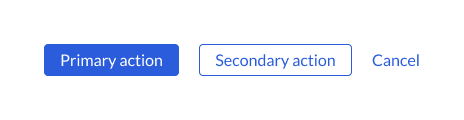

## Exercises

This repository has several exercises we may undertake for discussion and pairing purposes.

### Component not fully covered

A few files in the system aren't fully covered. Track them down and get them covered! Try writing a test for `Divider`!

### New component: `Button`

Make a `Button` component! Use the same conventions for writing, documenting, and testing a component as you see in `Divider`.

Here are some example variants:



- How would you go about doing this?
- What other variants might you consider? Think about other things Design may ask for in the future.
- How would you structure your variants? (E.g., `<PrimaryButton />` or `<Button variant="primary" />`)

### TypeScript conversion

Convert `Toggle` to TypeScript! Take its JSDoc props, convert them into TS interfaces, and rename the file and its test to `.tsx` files. Do the same for the storybook files.

Bonus: figure out how to use modern Storybook conventions to remove the need for a `.mdx` file entirely. Use other files as your guide.

### Awkward behavior

Customers are complaining that `ExpansionPanel`'s animations are weird and distracting. One of our eccentric designers thinks it looks fun and quirky. How would you handle this issue?

Bonus: play with some animations and find one that looks good!

### Testing behaviors

The React Hook `useOnClickOutside` isn't working correctly in certain situations. `useOnClickOutside` is used to call a function when a user clicks _outside_ of an HTML element. It's unit tested, and the tests all pass, but there's still a tricky bug.

- Find a way to reproduce this bug
- Track down and fix the bug
- Write a test to ensure the appropriate behavior

## Advanced Exercises:

### Weird warning when running `Toggle.test.jsx`

Track down and fix the following warning when running the Toggle test:

```sh
$ yarn test packages/confetti/src/components/Toggle/Toggle.test --collectCoverageFrom="packages/confetti/src/components/Toggle/Toggle.(t|j)sx" --watch

# ...
  console.error
    Warning: An update to Toggle inside a test was not wrapped in act(...).

    When testing, code that causes React state updates should be wrapped into act(...):

    act(() => {
      /* fire events that update state */
    });
    /* assert on the output */

    This ensures that you're testing the behavior the user would see in the browser. Learn more at https://reactjs.org/link/wrap-tests-with-act
        at id (/home/coder/frontend-engineer-interview-challenge/packages/confetti/src/components/Toggle/Toggle.jsx:25:3)

      52 |           return;
      53 |         }
    > 54 |         setSaved(true);
         |         ^
      55 |       });
      56 |     } else {
      57 |       onChange(event);
```

This is tough because it's not straightforward, and might involve refactoring. This problem is relates to [testing async callbacks in React](https://medium.com/@bmb21/reacts-sync-and-async-act-caa297b658b0). Use this as a way to discuss in-depth things like React rendering life cycles.

### Add coverage for `Toggle`

Increase the test coverage of Toggle to 100%.
